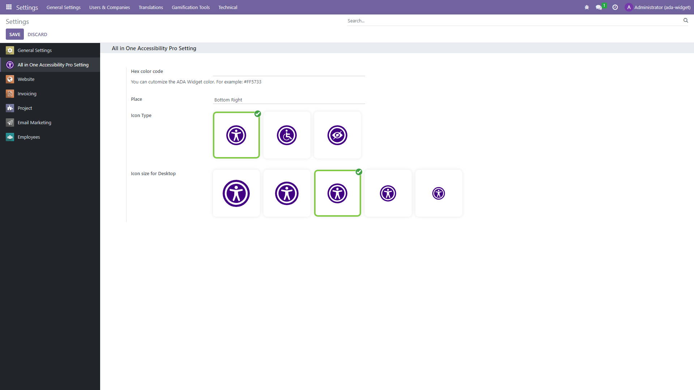

# All in One Accessibility®: Odoo module

## Enhance Your Website's Accessibility with All in One Accessibility®

**Did you know?** Your website's accessibility can make or break your audience's experience. With the **All in One Accessibility AI Widget**, you can instantly boost your site's inclusivity and support over **140+ languages**! Experience the power of **70+ essential features** in our pro version and take the first step towards creating a better web for everyone.

### Why All in One Accessibility®?

This lightweight and flexible widget is designed to improve your website’s compliance with **international accessibility standards**, including:

### **International Standards**

- **WCAG 2.0, 2.1, & 2.2** (Web Content Accessibility Guidelines)  
- **ATAG 2.0** (Authoring Tool Accessibility Guidelines)  
- **PDF/UA – ISO 14289** (Accessible PDF Format)

### **United States**
- **ADA (Americans with Disabilities Act)**  
- **ADA Title III Website Accessibility**  
- **Section 508 (U.S. Government Standard)**  
- **California Unruh Civil Rights Act**  
- **Texas Website Accessibility Compliance**  
- **Florida Website Compliance**  
- **Colorado Accessibility Law**  
- **Kentucky Web Accessibility**  
- **New York State Web Accessibility Policy**  
- **Arizona ADA Compliance**  
- **Connecticut ADA Web Accessibility**  
- **Indiana Digital Accessibility**  
- **Nevada ADA Compliance Requirements**  
- **Georgia Website ADA Compliance**  
- **Ohio ADA Compliance**  
- **Michigan ADA Compliance**  
- **Virginia Web Accessibility Legislation**  
- **Kansas ADA Compliance**  
- **Washington State ADA Compliance**

### **Canada**
- **AODA (Accessibility for Ontarians with Disabilities Act)**  
- **ACA (Accessible Canada Act)**

### **United Kingdom**
- **UK Equality Act (EA)**

### **European Union**
- **EAA / EN 301 549 Accessibility**  
- **EN 301 549 v4.1.1**

### **France**
- **RGAA (Référentiel Général d’Amélioration de l’Accessibilité)**

### **Germany**
- **BITV (Barrierefreie-Informationstechnik-Verordnung)**

### **Italy**
- **Italian Stanca Act**

### **Spain**
- **UNE 139803:2012**

### **Austria**
- **WZG (Austrian Web Accessibility Act)**

### **Switzerland**
- **Swiss Disability Discrimination Act (DDA)**

### **Sweden**
- **Swedish Discrimination Act (2008:567)**

### **Israel**
- **IS 5568 (Israeli Standard)**

### **Australia**
- **Australian DDA (Disability Discrimination Act)**

### **India**
- **RPD Act (Rights of Persons with Disabilities Act)**  
- **GIGW 3.0 (Guidelines for Indian Government Websites)**

### **Brazil**
- **LBI 13.146/2015 (Brazilian Inclusion Law)**

### **Mexico**
- **ADA-Inspired Web Accessibility Compliance**

### **Japan**
- **JIS X 8341**

### **South Korea**
- **KWCAG 2.1 (Korean Web Content Accessibility Guidelines)**

### **Singapore**
- **DSS and SGDS (Design System and Digital Standards)**

### **Malaysia**
- **PWD Act 2008 (Persons with Disabilities Act)**

### **Thailand**
- **PDA 2013 (Persons with Disabilities Empowerment Act)**

### **United Arab Emirates**
- **UAE Disability Act (Federal Law No. 29 of 2006)**

For more details on supported accessibility laws and standards, visit  
**[All in One Accessibility Supported Standards](https://www.skynettechnologies.com/accessibility-standards)**
By implementing the widget, you’re not only enhancing user experience but also minimizing the risk of costly accessibility lawsuits. For more details, visit **[All in One Accessibility®.](https://www.skynettechnologies.com/all-in-one-accessibility)**

### Built for Excellence

- Adheres to **ISO 9001:2015** & **ISO 27001:2013** standards.
- Fully compliant with **GDPR** and **COPPA** regulations.
- Proud member of **W3C** and the **International Association of Accessibility Professionals (IAAP)**.

**Your website’s accessibility journey begins here. Make an impact.**

For more details, visit **[All in One Accessibility®](https://www.skynettechnologies.com/all-in-one-accessibility)** and transform your digital presence.

### Supported Languages (140+ Languages):

English (USA), English (UK), English (Australian), English (Canadian), English (South Africa), Español, Español (Mexicano), Deutsch, عربى, Português, Português (Brazil), 日本語, Français, Italiano, Polski, Pусский, 中文, 中文 (Traditional), עִברִית, Magyar, Slovenčina, Suomenkieli, Türkçe, Ελληνικά, Latinus, Български, Català, Čeština, Dansk, Nederlands, हिंदी, Bahasa Indonesia, 한국인, Lietuvių, Bahasa Melayu, Norsk, Română, Slovenščina, Svenska, แบบไทย, Українська, Việt Nam, বাঙালি, සිංහල, አማርኛ, Hmoob, မြန်မာ, Eesti keel, latviešu, Cрпски, Hrvatski, ქართული, ʻŌlelo Hawaiʻi, Cymraeg, Cebuano, Samoa, Kreyòl ayisyen, Føroyskt, Crnogorski, Azerbaijani, Euskara, Tagalog, Galego, Norsk Bokmål, فارسی, ਪੰਜਾਬੀ, shqiptare, Hայերեն, অসমীয়া, Aymara, Bamanankan, беларускі, bosanski, Corsu, ދިވެހި, Esperanto, Eʋegbe, Frisian, guarani, ગુજરાતી, Hausa, íslenskur, Igbo, Gaeilge, basa jawa, ಕನ್ನಡ, қазақ, ខ្មែរ, Kinyarwanda, Kurdî, Кыргызча, ພາສາລາວ, Lingala, Luganda, lëtzebuergesch, македонски, Malagasy, മലയാളം, Malti, Maori, मराठी, Монгол, नेपाली, Sea, ଓଡିଆ, Afaan Oromoo, پښتو, Runasimi, संस्कृत, Gàidhlig na h-Alba, Sesotho, Shona, سنڌي, Soomaali, basa Sunda, kiswahili, тоҷикӣ, தமிழ், Татар, తెలుగు, ትግሪኛ, Tsonga, Türkmenler, Ride, اردو, ئۇيغۇر, o'zbek, isiXhosa, יידיש, Yoruba, Zulu, भोजपुरी, डोगरी, कोंकणी, Kurdî, Krio, मैथिली, Meiteilon, Mizo tawng, Sepedi, Ilocano, دری.

### Limitations:

* JavaScript must be enabled on the browser.

allinoneaccessibility/static/description/assets/screenshots/second.jpg)

## CORS Policy Configuration

To avoid CORS policy issues, ensure the following URLs are allowed in your website. These URLs should be added to your CORS configuration or trusted domains list.

| **Domain**                         | **Description**                              | **Usage**                        |
|------------------------------------|----------------------------------------------|----------------------------------|
| `https://*.skynettechnologies.com` | Skynet Technologies (Global Domain)          | API access and resources         |
| `https://*.skynettechnologies.us`  | Skynet Technologies (US Domain)              | API access and resources         |
| `https://*.googleapis.com`         | Google APIs                                  | Services like Fonts, Translation |
| `https://*.gstatic.com`            | Fonts APIs                                   | Custom Fonts                     |
| `https://vlibras.gov.br`           | VLibras - Brazilian Sign Language Service    | Sign Language                    |

## Instructions

1. Update your server's CORS configuration to include these URLs.
2. Ensure wildcard subdomains (`*`) are supported where necessary.
3. Verify the application functionality by testing requests to these domains.
4. If issues persist, consult the documentation for CORS configuration guidance.

## Configuration

To configure the widget, access the Admin Panel and head to the **All in One Accessibility** menu in the dashboard. From there, you can register **[here](https://ada.skynettechnologies.us/trial-subscription)** with 10 Days free trial.

## Documentation
- [Purchase Odoo All in One Accessibility](https://www.skynettechnologies.com/odoo-accessibility-app)
- [How to install All in One Accessibility App on Odoo](https://www.skynettechnologies.com/blog/odoo-web-accessibility-widget-installation)
- [All in One Accessibility - Features Guide](https://www.skynettechnologies.com/sites/default/files/accessibility-widget-features-list.pdf)

## Submit a Support Request

Please visit our **[support page](https://www.skynettechnologies.com/report-accessibility-problem)** and fill out the form. Our team will get back to you as soon as possible.

## Send Us an Email

Alternatively, you can send an email to our support team:
**[hello@skynettechnologies.com](mailto:hello@skynettechnologies.com)**

## Accessibility Paid Add-on Services

### **[Manual Accessibility Audit Report](https://www.skynettechnologies.com/all-in-one-accessibility/addons#manual-accessibility-audit-report)**

Enhance inclusivity and user experience by evaluating your website’s accessibility by accessibility experts.
WCAG 2.0 / WCAG 2.1 / WCAG 2.2 Level AA conformance testing.
Automated, semi-automated testing.
Manual testing.
Simple before-after UI/UX recommendations on how to fix the issues.
Comprehensive audit report.

### **[Manual Accessibility Remediation](https://www.skynettechnologies.com/all-in-one-accessibility/addons#manual-accessibility-remediation)**
Enhance website accessibility and inclusivity with our Manual Accessibility Remediation add-on. This service includes fixing accessibility issues and thorough remediation of your website manually. Our experts ensure accessibility with WCAG standards, improve user experience for those with disabilities, and provide a detailed report on the improvements made.

### **[PDF/Document Accessibility Remediation](https://www.skynettechnologies.com/all-in-one-accessibility/addons#pdf-document-remediation)**
The PDF / Document Remediation provides a list of inaccessible PDFs and remediated PDFs from where you can request PDF remediation service.
 
### **[VPAT Report/Accessibility Conformance Report(ACR)](https://www.skynettechnologies.com/all-in-one-accessibility/addons#vpat-acr-report)**
The Voluntary Product Accessibility Template (VPAT), also known as an ACR (Accessibility Conformance Report) starts with an audit and provides current details for an accessible website, application, or any other digital assets.

## Accessibility Widget Paid Add-ons

### **[White Label](https://www.skynettechnologies.com/all-in-one-accessibility/addons#accessibility-widget-add-ons)**
Remove the Skynet technologies logo as well as all of the footer links, popups, report a problem link and more for full white label control.

### **[Live Site Translations](https://www.skynettechnologies.com/all-in-one-accessibility/addons#accessibility-widget-add-ons)**
Translate your site into over 140 languages instantly to enhance accessibility for non-native speakers, individuals with language acquisition difficulties, and those with learning disabilities.

###  **[Modify Accessibility Menu](https://www.skynettechnologies.com/all-in-one-accessibility/addons#accessibility-widget-add-ons)**
Build and fine-tune your widget with the Modify Menu option. Reorder, remove and restructure the widget buttons to fit your users’ specific accessibility needs.

## Accessibility Partnership Opportunities

### **[Agencies Partnership](https://www.skynettechnologies.com/agency-partners)**

Partner with us as an agency to provide comprehensive accessibility solutions to your clients. Get access to exclusive resources, training, and support to help you implement and manage accessibility features effectively.

### **[Affiliated Partnership](https://www.skynettechnologies.com/affiliate-partner)**

Join our affiliate program and earn commissions by promoting All in One Accessibility®. Share our Widget with your network and help businesses improve their website accessibility while generating revenue.

For more details, Please visit **[Partnership Opportunities Page](https://www.skynettechnologies.com/partner-program)**

## Screenshots

## Video

## Credits

This addon is developed and maintained by [Skynet Technologies USA LLC](https://www.skynettechnologies.com)

## Current Maintainers
- [Skynet Technologies USA LLC](https://github.com/skynettechnologies)

