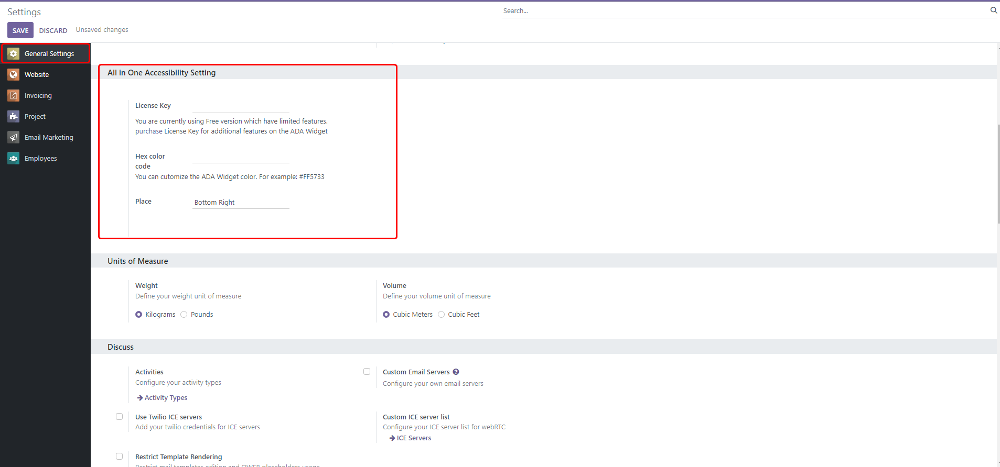
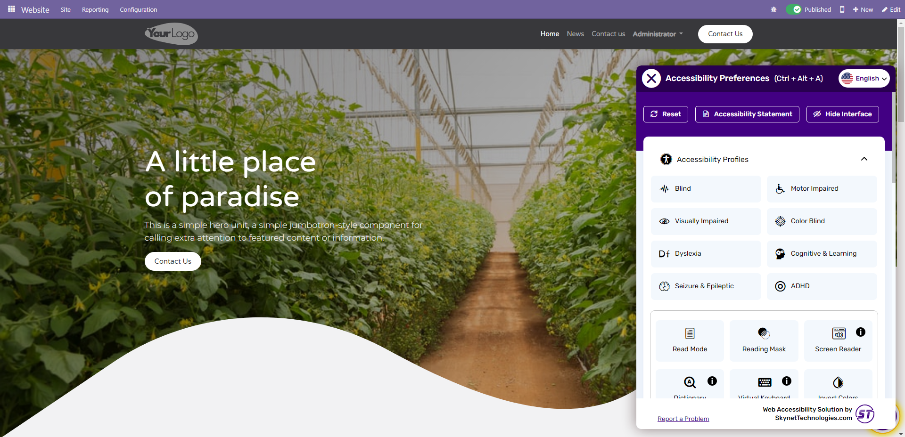

**Quick Web Accessibility Implementation with Odoo All In One Accessibility module!**

The All In One Accessibility widget is developed to improve accessibility and usability of your website. It uses the accessibility interface which handles UI and design related adjustments.

Enable wide array of people with disabilities to use your Odoo website effectively with All In One Accessibility widget. It will integrate basic accessibility features according to the **ADA, WCAG 2.1, Section 508, Australian DDA, European EAA EN 301 549, UK Equality Act (EA), Israeli Standard 5568, California Unruh, Ontario AODA, Canada ACA, German BITV, and France RGAA** standards to make it accessible to people with hearing or vision impairments, cognitive impairments, and perception problems.

Differentiate both the version (Free and Pro) and select based on your requirements.

[`All in One Accessibility introduction`](https://www.youtube.com/watch?v=PPQMWSzroAA) - introduction of All in One Accessibility widget .

### Odoo All In One Accessibility Free Version:

**Skip Links**

*   Skip to Menu
*   Skip to Footer
*   Skip to Navigation
*   Open Accessibility Toolbar

**Content Adjustments**

*   Adjust Font Sizing
*   Adjust Line Height
*   Content Scaling
*   Readable Fonts
*   Highlight Title
*   Highlight Links
*   Text Magnifier
*   Adjust Letter Spacing
*   Align Center
*   Align Left
*   Align Right

**Color Adjustments**

*   High Contrast

**Orientation Adjustments**

*   Hide Images
*   Reading Mask

**Multi-Language**

*   English
*   Spanish
*   German
*   Arabic
*   Slovak
*   Portuguese
*   French
*   Italian
*   Polish
*   Turkish
*   Japanese
*   Finnish
*   Russian
*   Hungarian
*   Latin
*   Greek
*   Hebrew
*   Bulgarian
*   Catalan
*   Chinese
*   Czech
*   Danish
*   Dutch
*   Hindi
*   Indonesian
*   Korean
*   Lithuanian
*   Malay
*   Norwegian
*   Romanian
*   Slovenian
*   Swedish
*   Thai
*   Ukrainian
*   Vietnamese
*   Bengali
*   Sinhala
*   Amharic
*   Hmong
*   Myanmar (Burmese)

**Miscellaneous**

*   Accessibility Statement
*   Dynamic Widget Color
*   Choose Widget Trigger Button Position
*   Choose Widget Position
*   Multi Language

  

### Odoo All In One Accessibility Pro Version: (It includes all the features of Free Version + additional features as below)

**Content Adjustments**

*   Content Scaling
*   Readable Fonts
*   Highlight Title
*   Highlight Links
*   Text Magnifier
*   Adjust Font Sizing
*   Adjust Line Height
*   Adjust Letter Spacing
*   Align Center
*   Align Left
*   Align Right

**Color Adjustments**

*   Dark Contrast
*   Monochrome
*   Light Contrast
*   High Saturation
*   High Contrast
*   Smart Contrast
*   Low Saturation
*   Invert Colors
*   Adjust Background Colors
*   Adjust Text Colors
*   Adjust Title Colors

**Orientation Adjustments**

*   Mute Sounds
*   Hide Images
*   Reading Guide
*   Stop Animation
*   Reading Mask
*   Highlight Hover
*   Highlight Focus
*   Big Black Cursor
*   Big White Cursor

**Multi-Language**

*   English
*   Spanish
*   German
*   Arabic
*   Slovak
*   Portuguese
*   French
*   Italian
*   Polish
*   Turkish
*   Japanese
*   Finnish
*   Russian
*   Hungarian
*   Latin
*   Greek
*   Hebrew
*   Bulgarian
*   Catalan
*   Chinese
*   Czech
*   Danish
*   Dutch
*   Hindi
*   Indonesian
*   Korean
*   Lithuanian
*   Malay
*   Norwegian
*   Romanian
*   Slovenian
*   Swedish
*   Thai
*   Ukrainian
*   Vietnamese
*   Bengali
*   Sinhala
*   Amharic
*   Hmong
*   Myanmar (Burmese)

**Miscellaneous**

*   Accessibility Statement
*   Dynamic Widget Color
*   Choose Widget Trigger Button Position
*   Choose Widget Position
*   Multi Language
*   Read Mode
*   Hide Interface

### Limitations:

*   JavaScript must be enabled on the browser.
